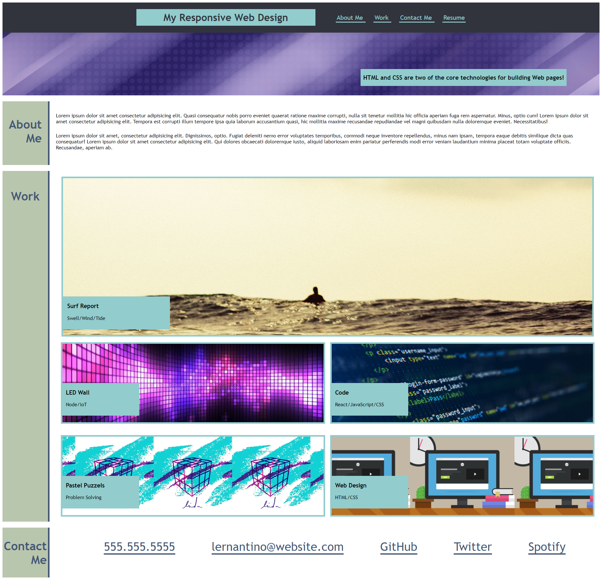

# My-Responsive-Web-Design

## Description

This homework, helped me learn advanced CSS including media query screen, flexbox layout, responsive design, flexbox placement, box styling, CSS resets, typography, pseudo classes and elements, form styles and custom forms, wireframing and CSS variables to design and create my personal porfolio. This coursework will help me create a sample portfolio that shows my name and avatar, including links to sections about, work and contact. Links in the navigation UI scrolls to the corresponding sections and resize to view the site on various screens and devices making the page responsive layout and adapts to viewport. The activities have helped me create a modern websites that employers and clients are looking for. Using these skills will help me make websites more responsive more easily so, whatever kind or size of device someone is using to view your site, it looks fantastic and works well.

## Installation

Using the GitHub account, created a repository and project and pushed the homework files to the repository folder
In GitHub, navigated to jak3ster.github.io repository and click Settings.
Then within Settings, navigate to the Source section within the Github Pages section. 
From the dropdown menu, select master branch and then click Save.

Using the link at hhttps://jak3ster.github.io/My-Responsive-Web-Design/.

## Usage

Screenshots added.

